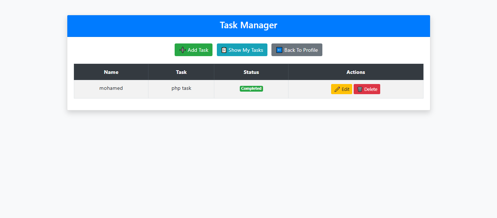

  

# 📝 Simple To-Do App (Pure PHP & OOP)

A simple To-Do List web application built using **Pure PHP with Object-Oriented Programming (OOP)** — without frameworks or databases.  
This project was created to practice PHP fundamentals, OOP concepts, and session-based data handling.

---

## 🚀 Features
- ➕ Add new tasks  
- ✅ Mark tasks as completed  
- ❌ Delete tasks  
- 💾 Data stored in PHP sessions  
- 💻 Clean and responsive design using Bootstrap  
- 🧱 Structured using PHP OOP (Classes & Methods)

---

## 🧠 What I Learned
- Handling forms with `$_POST`  
- Managing data with `$_SESSION`  
- Applying **OOP principles** (Encapsulation, Classes, Objects)  
- Implementing CRUD operations without a database  
- Building modular PHP code structure  
- Styling with Bootstrap for better UI

---

## 🛠️ Technologies Used
- **PHP (Pure OOP PHP)**  
- **HTML5**  
- **CSS3**  
- **Bootstrap 4**

---

## ⚙️ How to Run Locally

### Move the folder to your local server directory  
Example paths:
C:\laragon\www
C:\xampp\htdocs

### Start your local server:  
(e.g. Laragon or XAMPP)

### Open the app in your browser:
http://localhost/todoapp/

---

## 💡 Future Improvements
- Connect to a MySQL database  
- Add user authentication (Login/Register)  
- Save tasks permanently instead of using sessions  
- Add task editing and filtering  
- Improve UI with animations or dark mode

---

## 🧑‍💻 Author
   **Mohamed Ashraf**
    📧 Email: mohamed_ashraf4444@hotmail.com
    🌐 GitHub: https://github.com/salah3122001     

---
